# 🛍️ Shoppora – Full Stack Multi-Role E-Commerce Marketplace


A modern **Full Stack Multi-Role E-Commerce Marketplace** built using **React, TypeScript, Django REST Framework, and Tailwind CSS**.

<p align="center">
    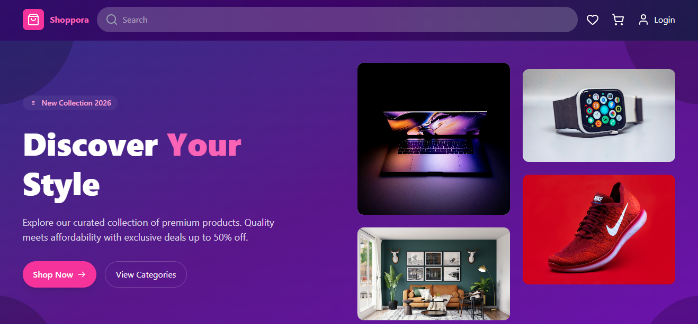
</p>

Shoppora simulates a real-world online marketplace where **Customers**, **Sellers**, **Delivery Partners**, and **Administrators** each have their own dashboards, permissions, and workflows.

---

# 📖 About This Project

Shoppora is a complete marketplace ecosystem rather than a simple shopping website.

Unlike traditional e-commerce applications that only focus on customers, this project implements an end-to-end marketplace architecture with role-based authentication, REST APIs, product management, order processing, delivery assignment, and admin controls.

This project was built to demonstrate full-stack software engineering concepts including:

- Role Based Access Control (RBAC)
- REST API Design
- Authentication & Authorization
- CRUD Operations
- State Management
- Component Architecture
- Backend API Development
- Responsive UI Design

---

## 📑 Table of Contents

- 📖 About This Project
- 🏗️ System Architecture
- 💡 Why I Built This Project
- 🚀 Features
- 🧠 Backend Modules
- ⚙️ Tech Stack
- 🎯 Highlights
- 📂 Project Structure
- 🔒 Role Based Access Control
- 🔗 REST APIs
- 📸 Application Screenshots
- 💻 Installation
- 🌍 Live Demo
- 🌟 Key Learning Outcomes
- 📈 Future Improvements
- 👨‍💻 Author

---

## 🏗️ System Architecture

```text
                 ┌─────────────────────────┐
                 │     React + TypeScript  │
                 │      (Frontend UI)      │
                 └────────────┬────────────┘
                              │
                     Axios HTTP Requests
                              │
                              ▼
                 ┌─────────────────────────┐
                 │ Django REST Framework   │
                 │      REST APIs          │
                 └────────────┬────────────┘
                              │
                     Django ORM Queries
                              │
                              ▼
                 ┌─────────────────────────┐
                 │      PostgreSQL         │
                 │      Database           │
                 └─────────────────────────┘

Authentication
      │
      ▼
JWT Tokens
      │
      ▼
Role-Based Access Control
      │
      ▼
Protected APIs
```

---

## 💡 Why I Built This Project

Most beginner e-commerce projects only focus on the customer experience.

I wanted to build a marketplace that resembles a production-style system where Customers, Sellers, Delivery Partners, and Administrators interact through a common backend while maintaining strict Role-Based Access Control (RBAC).

The primary goal was to gain hands-on experience designing scalable REST APIs, implementing secure authentication using JWT, structuring a modular Django backend, and integrating it with a responsive React frontend.

---

# 🚀 Features

## 👤 Authentication

- User Registration
- Secure Login
- JWT Authentication
- Protected Routes
- Role Based Access

Supported Roles

- Customer
- Seller
- Delivery Partner
- Administrator

---

## 🛒 Customer Features

- Browse Products
- Product Search
- Wishlist
- Shopping Cart
- Checkout
- Order History
- Address Management
- Profile Management

---

## 🏪 Seller Dashboard

- Add Products
- Edit Products
- Delete Products
- View Orders
- Product Analytics
- Seller Settings

---

## 🚚 Delivery Dashboard

- Assigned Deliveries
- Completed Deliveries
- Delivery Statistics
- Order Status Updates

---

## 🛡️ Admin Dashboard

- Manage Users
- Manage Sellers
- Manage Products
- Manage Orders
- Delivery Management
- Dashboard Analytics
- Platform Settings

---

## 📦 Product Management

- Product Categories
- Product Images
- Descriptions
- Stock Management
- Seller Ownership

---

## ❤️ Wishlist

- Save Products
- Remove Products
- Move Wishlist Items to Cart

---

## 🛒 Shopping Cart

- Add Items
- Remove Items
- Quantity Updates
- Price Calculation
- Persistent Cart

---

## 📧 Newsletter

- Email Subscription API

---

# 🧠 Backend Modules

The backend is developed using Django REST Framework.

### Core Django Applications

| Module     | Responsibility                    |
| ---------- | --------------------------------- |
| accounts   | Authentication, Users & Addresses |
| products   | Product Catalog                   |
| cart       | Shopping Cart                     |
| wishlist   | Wishlist Management               |
| orders     | Order Processing                  |
| newsletter | Newsletter Subscription           |
| config     | Project Configuration             |

Each module exposes dedicated REST APIs following modular architecture.

---

# ⚙️ Tech Stack

## Frontend

- React 19
- TypeScript
- Tailwind CSS
- React Router DOM
- Context API
- Axios
- Vite

---

## Backend

- Django
- Django REST Framework
- Simple JWT
- PostgreSQL
- Django ORM

---

## Tools

- Git
- GitHub
- VS Code
- Postman

---

# 🎯 Highlights

- Multi-role authentication using JWT
- Modular Django REST Framework backend
- Role-Based Access Control (RBAC)
- Responsive React frontend
- Context API state management
- RESTful API integration using Axios
- Dashboard analytics with interactive charts
- Secure protected routes

---

# 📂 Project Structure

```

Shoppora/
│
├── README.md ( this file )
├── LICENSE
├── screenshots/
│ ├── homepage.png
│ ├── login.png
│ ├── wishlist.png
│ ├── cart.png
│ ├── payment.png
│ ├── orders-page.png
│ ├── seller-dashboard.png
│ ├── delivery-dashboard.png
│ └── admin-dashboard.png
│
├── backend/
│ │
│ ├── accounts/ - Authentication & User Management
│ ├── cart/ - Shopping Cart
│ ├── orders/ - Order Processing
│ ├── products/ - Product Catalog
│ ├── wishlist/ - Wishlist Management
│ ├── newsletter/ - Newsletter Subscription
│ ├── config/ - Django Configuration
│ └── manage.py
│
│
└── frontend/
│
└──src/
├── assets/
├── components/
│ ├── admin/
│ ├── customer/
│ ├── delivery/
│ └── seller/
├── context/
├── pages/
├── services/
├── types/
└── utils/

```

---

# 🔒 Role Based Access Control (RBAC)

| Role     | Permissions                  |
| -------- | ---------------------------- |
| Customer | Shop, Cart, Wishlist, Orders |
| Seller   | Manage Products & Orders     |
| Delivery | Assigned Deliveries          |
| Admin    | Complete Platform Management |

---

# 🔗 REST APIs

Major API Modules

```

/api/accounts/
/api/products/
/api/cart/
/api/orders/
/api/wishlist/
/api/newsletter/

```

<h2 align="center">📸 Application Screenshots</h2>

<table>
<tr>
<td align="center">
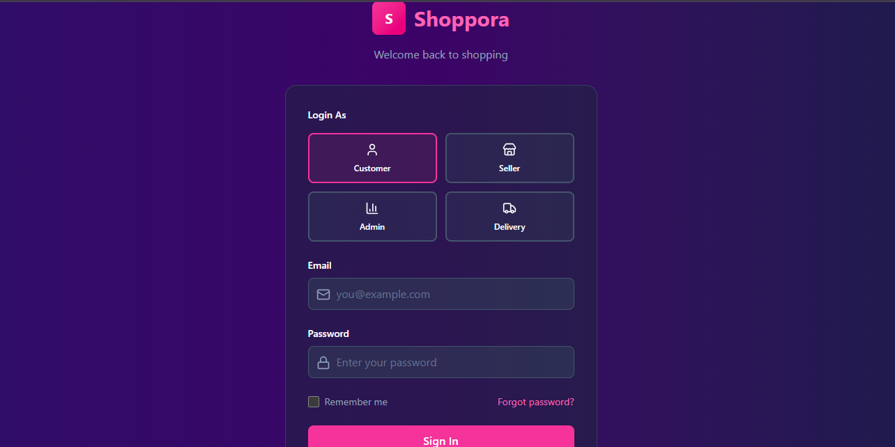
<br/>
<b>Login Page</b>
</td>

<td align="center">

<br/>
<b>Homepage</b>
</td>
</tr>

<tr>
<td align="center">
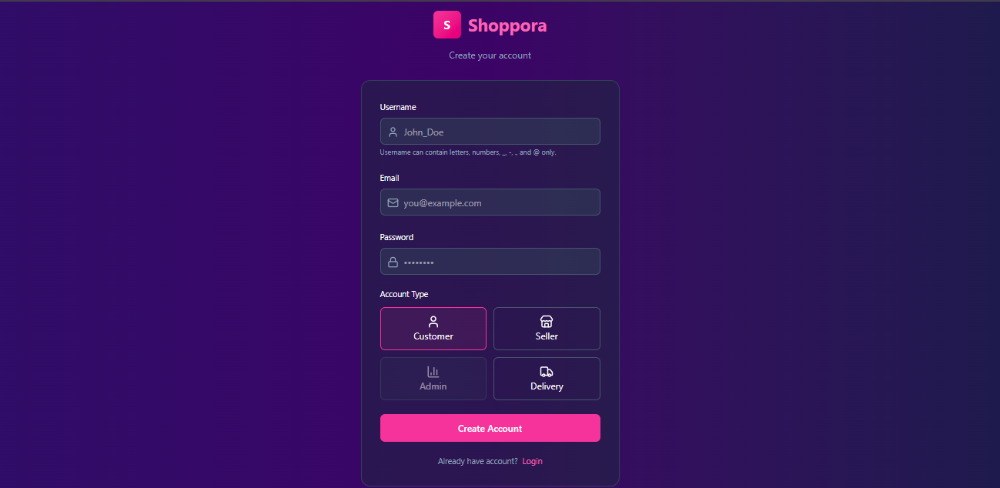
<br/>
<b>Signup</b>
</td>

<td align="center">
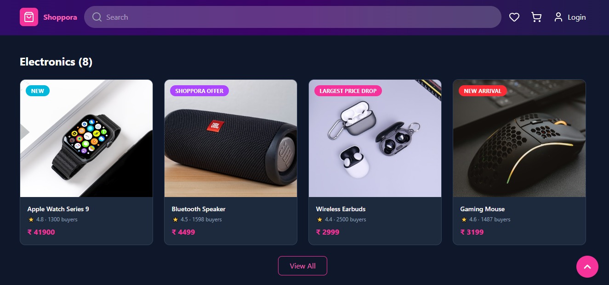
<br/>
<b>Products Section</b>
</td>
</tr>

<tr>
<td align="center">
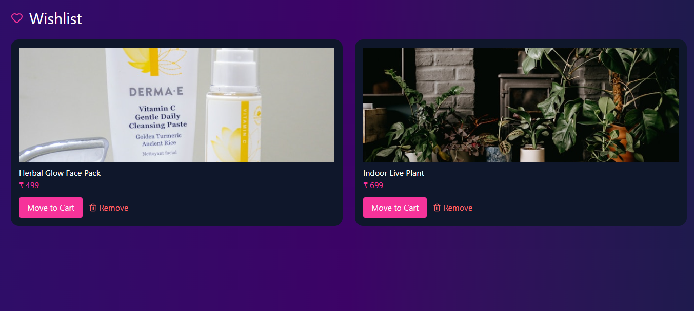
<br/>
<b>Wishlist</b>
</td>

<td align="center">
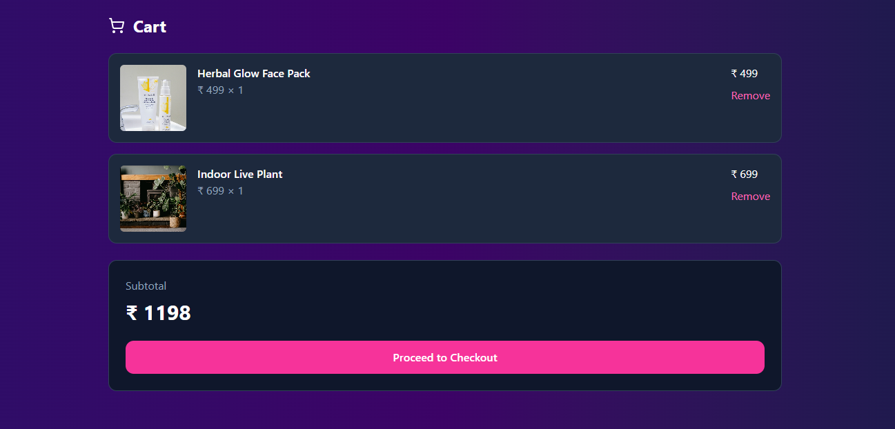
<br/>
<b>Cart</b>
</td>
</tr>

<tr>
<td align="center">
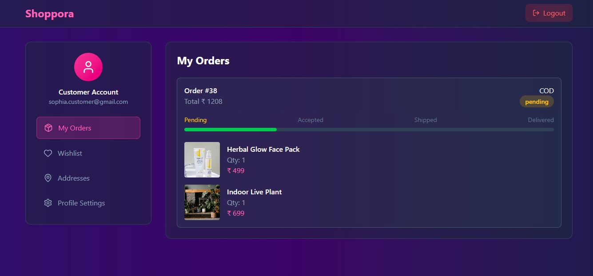
<br/>
<b>Customer Dashboard</b>
</td>

<td align="center">
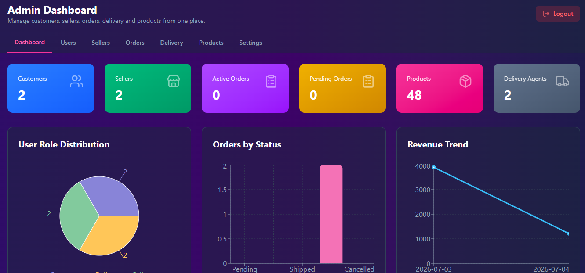
<br/>
<b>Admin Dashboard</b>
</td>
</tr>

<tr>
<td align="center">
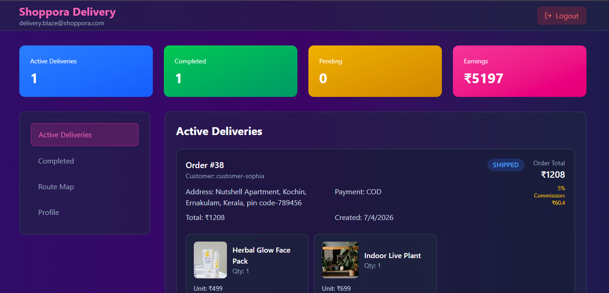
<br/>
<b>Delivery Dashboard</b>
</td>

<td align="center">
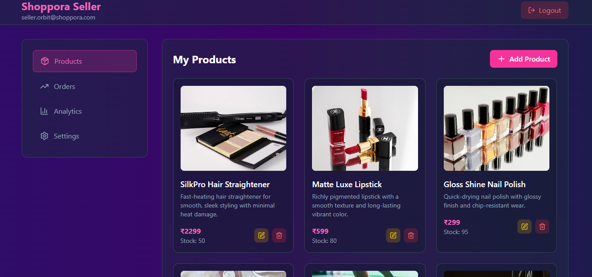
<br/>
<b>Seller Dashboard</b>
</td>
</tr>

<tr>
<td align="center">
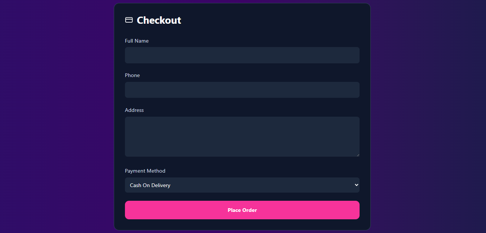
<br/>
<b>Checkout</b>
</td>

<td>
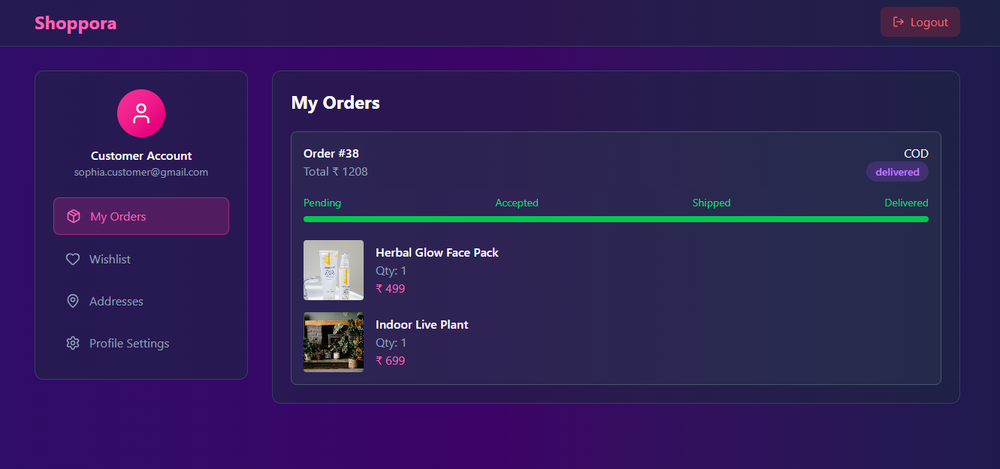
<br/>
<b>Orders</b>
</td>

</tr>

</table>

---

# 💻 Installation

## Clone Repository

```bash
git clone https://github.com/Mohamed-Asif-1000/shoppora-fullstack-ecommerce-platform.git
```

```bash
cd shoppora-fullstack-ecommerce-platform
```

---

# ⚙️ Backend Setup

Navigate to the backend directory

```bash
cd backend
```

### Create a Virtual Environment

```bash
python -m venv .venv
```

### Activate the Virtual Environment

**Windows (PowerShell)**

```powershell
.venv\Scripts\activate
```

**Linux / macOS**

```bash
source .venv/bin/activate
```

### Install Dependencies

```bash
pip install -r requirements.txt
```

### Configure Environment Variables

Create a `.env` file from `.env.example`.

**Windows (PowerShell)**

```powershell
Copy-Item .env.example .env
```

**Linux / macOS**

```bash
cp .env.example .env
```

Update the `.env` file with your configuration (database credentials, secret key, email settings, etc.).

### Apply Database Migrations

```bash
python manage.py migrate
```

### Create a Superuser (Optional)

```bash
python manage.py createsuperuser
```

### Start the Development Server

```bash
python manage.py runserver
```

The backend will be available at:

```
http://127.0.0.1:8000/
```

---

# Frontend Setup

```bash
cd frontend
```

Install Packages

```bash
npm install
```

Configure Environment Variables

```bash
cp .env.example .env
```

Run Development Server

```bash
npm run dev
```

---

## 🌍 Live Demo

🔗 Frontend:

> Backend deployment is planned.

---

# 🌟 Key Learning Outcomes

This project demonstrates practical implementation of:

- Full Stack Development
- Django REST APIs
- React Architecture
- Context API
- Authentication
- Authorization
- CRUD Operations
- Protected Routes
- REST Communication
- Modular Project Structure
- Role Based Access Control
- Responsive Design

---

# 📈 Future Improvements

- Stripe Payment Integration
- Razorpay Integration
- AI Product Recommendation
- Product Reviews
- Ratings
- Inventory Alerts
- Email Verification
- Password Reset
- Docker Support
- PostgreSQL
- Redis
- Celery
- CI/CD Pipeline
- AWS Deployment

---

## 🙏 Resources & Credits

This project was made possible with the help of the following open-source tools and resources:

- **React** — Frontend UI library
- **Django** & **Django REST Framework** — Backend framework and REST APIs
- **Tailwind CSS** — Utility-first CSS framework
- **Vite** — Frontend build tool
- **Lucide React** — Modern icon library
- **Axios** — HTTP client for API communication
- **Simple JWT** — Authentication using JSON Web Tokens

### Design Assets

- **Unsplash** — High-quality royalty-free product images
- **Pixabay** — Royalty-free images and media assets
- **Google Gemini** — AI-generated product images and design assets used for demonstration purposes

## Special thanks to the open-source community for providing excellent libraries, tools, and resources that made this project possible.

## 📄 License

This project is licensed under the MIT License.

## See the [LICENSE](LICENSE) file for more details.

## 👨‍💻 Author

### Mohamed Asif A

Full Stack Developer

- GitHub: https://github.com/Mohamed-Asif-1000
- LinkedIn:

---

# ⭐ Support

If you found this project useful, please consider giving it a ⭐ on GitHub.

It really helps and motivates further development.
